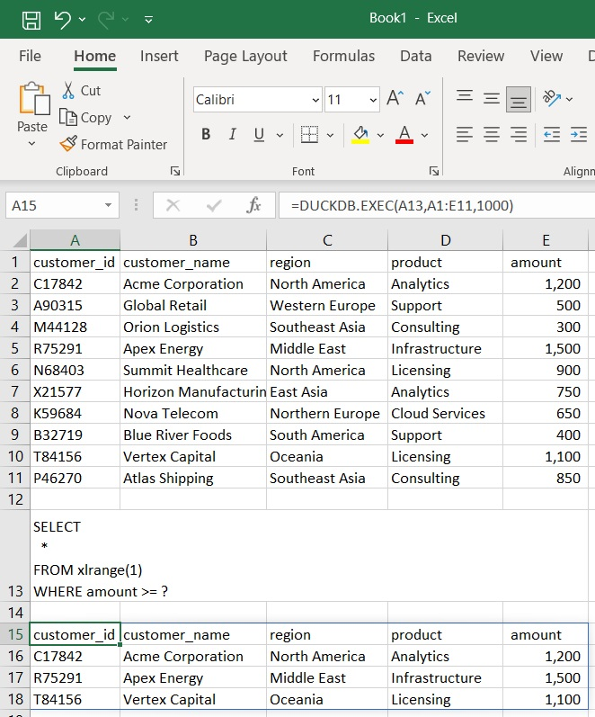

# DuckDBExcelAddin

A native Microsoft Excel XLL add-in that enables running SQL directly against Excel ranges using DuckDB.

The add-in provides:

- Native DuckDB integration inside Excel
- Excel range table functions (`xlrange`)
- Prepared statements with parameter binding
- Multiple SQL statements in a single execution
- Asynchronous execution
- Dynamic-array (spill range) output
- Configurable schema inference
- Lightweight deployment
- No .NET runtime dependency

> Status: Beta / Early Release
>
> Core functionality is implemented and usable for day-to-day
> workloads. APIs and behavior may still evolve before the first
> stable release.

---

# Screenshot



---

# Quick Summary

✅ Query Excel ranges

✅ Bind Excel values to SQL

✅ Async Execution

✅ Native Excel XLL

✅ No .NET runtime dependency

✅ Two-file deployment (`.xll` + `duckdb.dll`)

✅ DuckDB 1.5+

✅ Runtime DuckDB DLL upgrade

---

# Why This Project?

This project was inspired by **xlduckdb**, which demonstrated integration between DuckDB and Microsoft Excel through an XLL add-in.

The design goals of this project are slightly different.

## Comparison with xlduckdb

| Feature | DuckDBExcelAddin | xlduckdb |
|----------|----------|----------|
| Native Excel formula experience | ✅ | ✅ |
| Dynamic array (spill) results | ✅ | ✅ |
| Query external files | ✅ | ✅ |
| Query Excel ranges | ✅ | ✅ |
| Column type sampling option | ✅ | ❌ |
| Bind Excel values to SQL | ✅ | ❌ |
| Helpers for Excel date and time values | ✅ | ❌ |
| Async execution | ✅ | ❓ |
| Runtime DuckDB DLL upgrade | ✅ | ❓ |
| XLL implementation | ✅ | ✅ |
| .NET free | ✅ | ❌ |

*Comparison based on publicly documented features available at the time of writing.*

## Query Excel ranges

Similar to xlduckdb, Excel ranges are directly exposed as DuckDB tables.

```excel
=DUCKDB.EXEC(
"SELECT *
 FROM xlrange(1)
 WHERE cif = 10001",
A1:D100
)
```

With inference options:

```excel
=DUCKDB.EXEC(
"SELECT *
 FROM xlrange(1, sample=50)
 WHERE cif = 10001",
A1:D100
)
```

```excel
=DUCKDB.EXEC(
"SELECT *
 FROM xlrange(1, all_varchar=true)
 WHERE cif = 10001",
A1:D100
)
```

## Bind Excel values to SQL

Supports DuckDB prepared statements and positional placeholders.

```excel
=DUCKDB.EXEC(
"SELECT *
 FROM xlrange(1)
 WHERE cif = ?",
A1:D100,
10001
)
```

Use case: Dynamic range selector

```excel
=DUCKDB.EXEC(
"SELECT *
 FROM xlrange(?)
 WHERE cif = ?",
A1:D100,
F1:I200,
2,
10001
)
```

Use case: Dynamic file reader

```excel
=DUCKDB.EXEC(
"SELECT *
 FROM read_duckdb(?, table_name=?)
 LIMIT 100",
"Path\db.duckdb",
"mytable"
)
```

Use case: Dynamic column selector

```excel
=DUCKDB.EXEC(
"SELECT columns(?)
 FROM read_duckdb(?, table_name=?)
 LIMIT 100",
"column1",
"Path\db.duckdb",
"mytable"
)
```

Use case: Dynamic table selector

```excel
=DUCKDB.EXEC(
"CREATE TABLE mytable(col1) AS
 SELECT * FROM range(10);
 SELECT *
 FROM query_table(?)",
"mytable"
)
```

Benefits:

- Safer query construction
- No string concatenation in formulas
- Reusable SQL templates
- Natural DuckDB workflow

## Asynchronous Execution

Supports asynchronous worksheet functions. Long-running queries do not block Excel recalculation.

```excel
=DUCKDB.EXEC.ASYNC(...)
```

## Excel Date and Time Values

Adds scalar functions to convert Excel date and time values stored as DOUBLE to DuckDB DATE, TIME and TIMESTAMP.

```excel
=DUCKDB.EXEC(
"SELECT xldate(date_col)
 FROM xlrange(1)",
A1:D100
)
```

```excel
=DUCKDB.EXEC(
"SELECT xltime(time_col)
 FROM xlrange(1)",
A1:D100
)
```

```excel
=DUCKDB.EXEC(
"SELECT xldatetime(datetime_col)
 FROM xlrange(1)",
A1:D100
)
```

## Lightweight Native Deployment

The add-in is implemented entirely in C.

Benefits:

- No .NET runtime dependency
- Fast startup
- Small deployment footprint

Deployment typically consists of:

```text
DuckDBExcelAddIn.xll
duckdb.dll
```

## Drop-In DuckDB Upgrades

DuckDB is loaded dynamically at runtime.

Upgrading DuckDB generally requires only replacing:

```text
duckdb.dll
```

with a newer compatible version.

No recompilation of the XLL is required.

---

# Architecture

DuckDBExcelAddin executes SQL inside the Excel process using the
embedded DuckDB engine.

Excel ranges are exposed to DuckDB through the xlrange() table
function, allowing worksheet data to participate in SQL queries.

SQL statements are extracted, then each statement is prepared,
bound with parameters, and executed.

The result of the final statement is materialized and returned
to Excel as a dynamic array (spill range).

---

# Requirements

## Microsoft Excel

The add-in requires:

- Microsoft Excel 64-bit
- Dynamic Array (Spill Range) support

Supported versions include:

- Microsoft 365 Excel (64-bit)
- Excel 2021 (64-bit)
- Excel 2024 (64-bit)

Older Excel versions without Dynamic Arrays are not supported.

## Platform

- Windows x64
- Excel x64
- DuckDB x64

---

# Dependencies

## Runtime

- DuckDB 1.5.0 or later (`duckdb.dll`)

## Build Requirements

- Excel XLL SDK
  - `XLCALL`
  - `FRAMEWRK`
- DuckDB C API
  - `duckdb.h`
  - `duckdb.dll`

---

# Compiler Support

Development and testing are performed primarily using:

- MinGW-w64 (w64devkit)

Other toolchains such as Visual Studio (MSVC) may work but are currently unverified.

Contributions and testing reports are welcome.

---

# Build Notes

## XLCALL.H, FRAMEWRK.C Compatibility

Some versions of `XLCALL.H` contain a struct member named:

```c
bool
```

which conflicts with the C99/C11 keyword.

You may need to modify the SDK header locally.

Example:

```c
bool
```

rename to:

```c
xbool
```

and update the corresponding references in FRAMEWRK.C.

This modification only affects local compilation and does not affect runtime behavior.

## FRAMEWRK Linker Requirement

`FRAMEWRK` depends on legacy Excel4-family APIs.

When building with MinGW-w64 or w64devkit, unresolved external references may occur even though those functions are never used by the add-in.

`excel4workaround.c` provides stub implementations:

```c
#include <windows.h>
#include "XLCALL.H"

int _cdecl Excel4(int xlfn, LPXLOPER operRes, int count,... )
{
   return xlretFailed;
}

int pascal Excel4v(int xlfn, LPXLOPER operRes, int count, LPXLOPER opers[])
{
   return xlretFailed;
}
```

These functions exist only to satisfy linker requirements introduced by `FRAMEWRK`.

---

# Installation

Copy:

```text
DuckDBExcelAddIn.xll
duckdb.dll
```

Open the XLL directly, or add it through the Excel Add-ins dialog.

---

# Worksheet Function References

## DUCKDB.EXEC

Executes one or more SQL statements.

### Supports

- Query Excel ranges via `xlrange()`
- Bind Excel values to SQL (`?`)

### Syntax

```excel
=DUCKDB.EXEC(
    sql,
    [range1],
    [range2],
    ...,
    [param1],
    [param2]
)
```

### Note

- Ranges must appear before scalar parameters.
- When multiple SQL statements are supplied, all statements are
executed sequentially, but only the result of the final statement
is returned to Excel.

## DUCKDB.EXEC.ASYNC

Asynchronous version of `DUCKDB.EXEC`.

### Advantages

Long-running queries do not block Excel recalculation.

### Disadvantages

Introduces overhead due to thread creation and deep copying of worksheet ranges.

## DUCKDB.INFO

Returns diagnostic information about the add-in and the currently loaded DuckDB runtime.

This function is useful for:

- Verifying the installed add-in version
- Confirming which DuckDB version is loaded
- Troubleshooting deployment and upgrade issues

### Syntax

```excel
=DUCKDB.INFO()
```

### Example Result

```text
Add-in version: v0.3.0
DuckDB version: v1.5.4
```

### Notes

- The add-in version is supplied at build time through the `ADDIN_VERSION` build variable.
- Development builds display `dev` when no version is specified.
- The DuckDB version is obtained from the loaded `duckdb.dll`.
- This function can be used to verify that a DuckDB DLL upgrade has been loaded successfully.

---

# DuckDB Table Function References

## xlrange

Exposes Excel ranges as DuckDB tables.

### Syntax

```sql
xlrange(index, sample=n, all_varchar=true)
```

### Note

- index (required) is the 1-based position of an Excel range passed to DUCKDB.EXEC or DUCKDB.EXEC.ASYNC
- sample specifies the number of data rows used for type inference. A value of 0 samples all data rows. Defaults to 30 rows.
- When all_varchar = true, all values are returned as VARCHAR and type inference is disabled.
- The first row is always interpreted as column names and is not returned as data.
- Column names must be non-empty and valid DuckDB identifiers.

### Type Mapping

| Excel Value | DuckDB Type |
|------------|-------------|
| Number | DOUBLE or INTEGER |
| Boolean | BOOLEAN |
| Text | VARCHAR |
| Empty/Null | Ignored during inference |

### Inference Strategy

1. Scan for the first non-empty value and use its type as the candidate column type. Integer-valued numeric cells are inferred as INTEGER when all sampled numeric values fit within INT32.

2. Sample the remaining rows up to the configured sample limit.

3. If incompatible types are encountered, fall back to VARCHAR.

# DuckDB Scalar Function References

## xldate

Convert an Excel serial date value to a DuckDB DATE.

### Syntax

```sql
xldate(value)
```

## xltime

Convert the fractional portion of an Excel serial value to a DuckDB TIME.

### Syntax

```sql
xltime(value)
```

## xldatetime

Convert an Excel serial datetime value to a DuckDB TIMESTAMP.

### Syntax

```sql
xldatetime(value)
```

---

# Limitations

## Excel Worksheet Limits

Results are returned as Excel Dynamic Arrays.

Excel limits apply:

| Limit | Value |
|---------|---------|
| Rows | 1,048,576 |
| Columns | 16,384 |
| String length | 32,767 |

Queries exceeding these limits are not supported.

## Excel Number Types

Big DuckDB numeric types (BIGINT, HUGEINT, DECIMAL) may lose precision when converted to Excel numbers (DOUBLE).

## Excel Date and Time

Excel date and time values are stored internally as DOUBLE values.

Use xldate(), xltime(), and xldatetime() when DuckDB DATE, TIME,
or TIMESTAMP semantics are required.

## DuckDB Composite Types

Excel cells can only represent a limited set of scalar values.

DuckDB composite types such as:

- LIST
- STRUCT
- MAP
- UNION

are currently **not returned directly to Excel**.

Attempting to return these types will return an error.

Workaround:

```sql
SELECT CAST(my_struct AS VARCHAR)
```

or:

```sql
SELECT to_json(my_struct)
```

## Excel Range-Based Data Exchange

Input data is supplied through Excel ranges and output data is returned through Excel ranges.

Consequently:

- Excel worksheet limits apply.
- Large datasets may consume significant memory.
- Both source and result data must fit within Excel's worksheet model.

For large-scale analytics, it is generally more efficient to query:

- DuckDB databases
- Parquet files
- CSV files
- Other external DuckDB-supported data sources

directly through DuckDB rather than loading all data into Excel worksheets.

Example:

```sql
SELECT *
FROM read_parquet('large_dataset.parquet')
LIMIT 1000
```

Or only fetch aggregate data to the worksheet for the next step in your workflow.

## Not Intended as a Large Data Storage Engine

This add-in is optimized for:

- Excel-centric workflows
- Interactive analysis
- Ad-hoc queries
- Reporting

It is not intended to replace dedicated database systems or data engineering pipelines.

---

# Troubleshooting

## Add-in fails to load

Verify:

- Excel is 64-bit
- duckdb.dll is 64-bit
- duckdb.dll is located next to DuckDBExcelAddIn.xll
- The add-in is not blocked

## #VALUE! returned

Verify:

- SQL syntax is valid
- Dynamic Arrays are supported
- Result size does not exceed Excel limits

## #SPILL! error

Verify:

- The destination spill range is empty.
- There are enough rows and columns available to display the result.

---

# Motivation

DuckDB has fundamentally changed what is possible for local and offline analytics.

Many analytical workflows traditionally relied on combinations of:

- Database servers
- ETL pipelines
- Python notebooks
- BI tools

These tools can be difficult to deploy and are often unfamiliar to many office users and managers.

These tasks can now be performed locally using a single embedded analytical database.

One of the goals of this project is to bring that capability closer to everyday Excel users.

Excel remains one of the most widely used analytical tools, especially among finance, accounting, auditing, operations, risk management, and business users. However, many analytical workloads have outgrown what traditional Excel formulas, PivotTables, Power Query and worksheets can efficiently handle.

By combining Excel with DuckDB, users can:

- Query large datasets using SQL
- Join data sources efficiently
- Perform analytical aggregations
- Work with millions of records outside Excel's traditional calculation engine
- Remain inside a familiar Excel environment

The intention is not to replace data engineering or data science tools, but to lower the barrier for office users who need more analytical power than Excel alone can provide.

Many office users already possess strong domain expertise but are often limited by tooling complexity.

The goal of this project is to provide a practical path from traditional spreadsheet analysis to modern analytical workflows, enabling users to leverage SQL and DuckDB without requiring Python, complex frameworks, database servers, or specialized data engineering tools.

Hopefully this add-in helps more people discover DuckDB and enables Excel users to work with larger datasets that would otherwise require complicated tooling, frameworks, or programming knowledge.

---

# Acknowledgements

Special thanks to the DuckDB team and contributors.

DuckDB is an extraordinary project that brings tremendous value to local and offline analytics. Its performance, simplicity, and embedded architecture make advanced analytical processing accessible to a much wider audience.

This project would not exist without the work of the DuckDB community.

Special thanks to xlduckdb, which I have used in real-world workflows and which inspired the formula-based integration approach and the xlrange concept.

Additional thanks to:

- Microsoft Excel XLL SDK

Parts of this documentation were drafted with AI assistance and reviewed manually.

---

# License

MIT License
